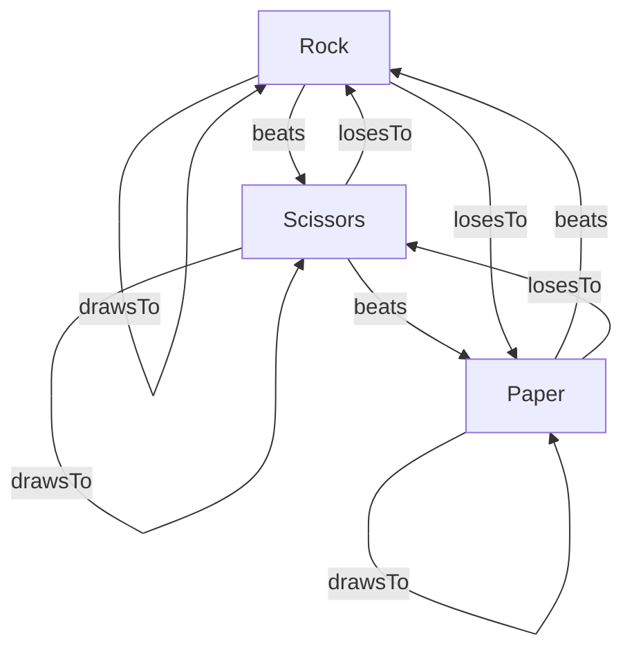

These are the relationships for day two, represented as a directed acyclic graph, drawn using mermaid.

```mermaid
flowchart TD
    Rock -->|beats| Scissors
    Scissors -->|beats| Paper
    Paper -->|beats| Rock
    Rock -->|losesTo| Paper
    Scissors -->|losesTo| Rock
    Paper -->|losesTo| Scissors
    Rock -->|drawsTo| Rock
    Scissors -->|drawsTo| Scissors
    Paper -->|drawsTo| Paper
```